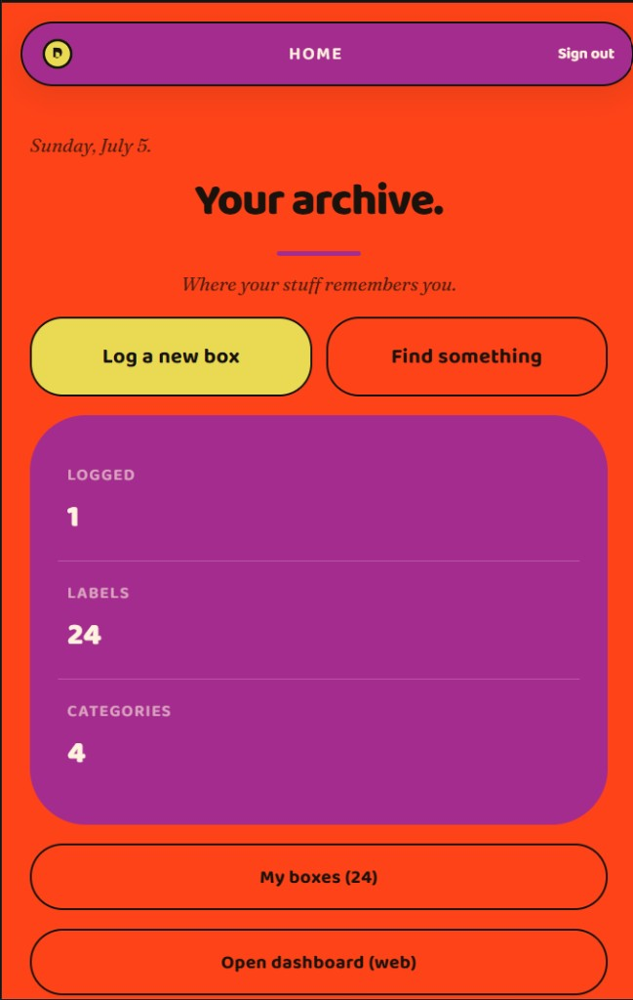
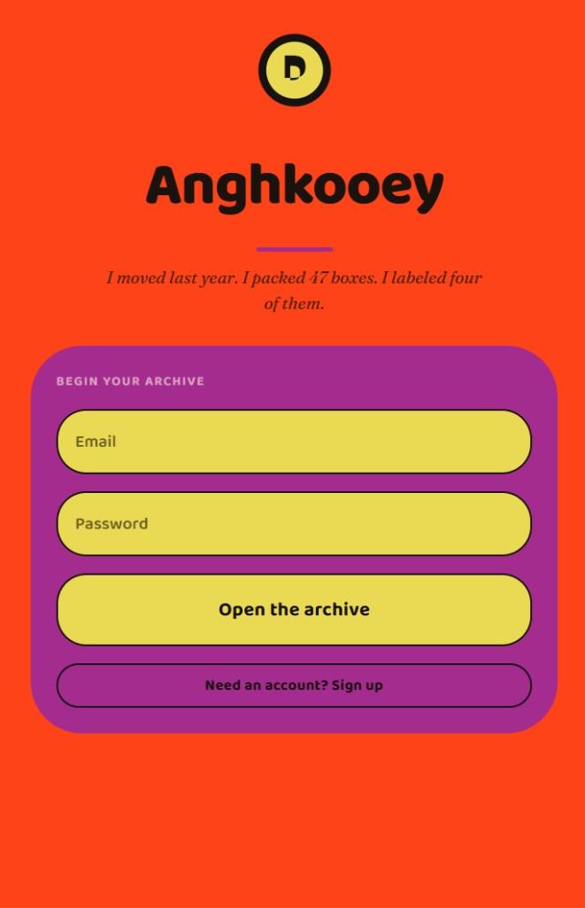
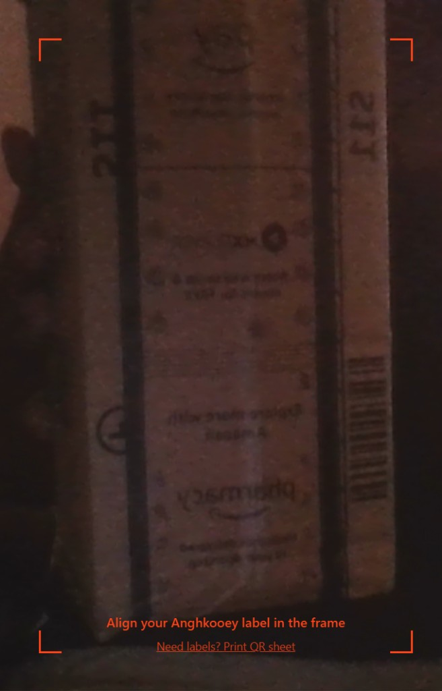
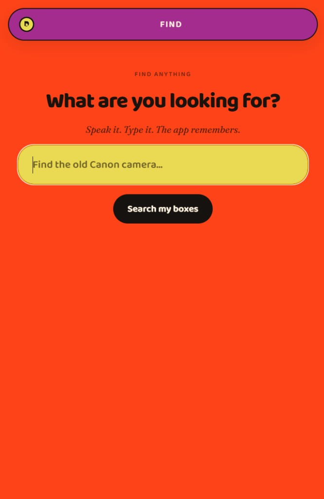
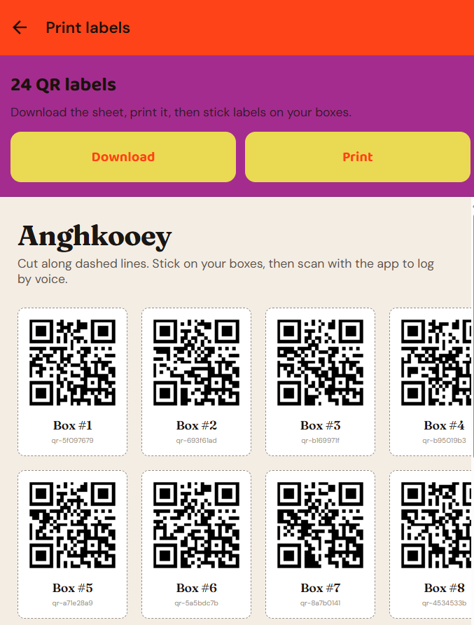

# Anghkooey

**A memory layer for your physical stuff.**

Stick a QR label on a box. Scan it. Speak what's inside. Find it months later — by voice, by search, or by pointing your camera at the room. Share a box with a partner and they can scan the same sticker to see what you stored.

Built for [RAISE 2026](https://raise.dev) — voice-first physical inventory with account-bound QR labels.

---

## The problem

Every adult has boxes they stopped opening. Storage units, garages, parent basements, the closet of winter clothes. When you need something, you don't know where it is.

Handwritten labels fade. Spreadsheets lie. Memory fails — especially after six months.

> *"I moved last year. I packed 47 boxes. I labeled four of them."*

---

## The idea

| Step | What happens |
|------|----------------|
| **Print** | Sign up → generate a sheet of 24 QR labels tied to your account |
| **Pack** | Scan a label → hold the mic → speak what's inside while your hands are full |
| **Forget** | Do nothing. The app remembers every item and where you last put the box |
| **Find** | Ask *"Where's the old Canon camera?"* → get the box, a quote from your voice log, and a location hint |
| **Share** | Invite a partner by email — they scan your QR and see what's inside (read-only) |

**Not** a spreadsheet. **Not** a photo album. A voice log bound to *your* QR namespace.

---

## Screenshots

### Home — your archive at a glance

Floating capsule nav, pill CTAs, and a stat card showing logged boxes, labels, and categories.



### Login — open your archive

Centered hero wordmark, italic epigraph, and a scoop card with pill inputs.



### Scan — align your label

Full-bleed camera with corner brackets. Scan an Anghkooey QR to open the voice log for that box.



### Find — semantic search across every box

Yellow pill search bar. Results show box name, item count, location hint, and a snippet from your original voice log.



### Print — 24 QR labels per account

Download or print an A4 sheet. Cut along dashed lines, stick on boxes, scan with the app.



---

## 90-second demo flow

See **[docs/DEMO-SCRIPT.md](docs/DEMO-SCRIPT.md)** and **[docs/PRE-DEMO-CHECKLIST.md](docs/PRE-DEMO-CHECKLIST.md)** for the full judge-facing script.

| Beat | Screen | What to show |
|------|--------|--------------|
| 1 | Login | *"Open the archive"* — epigraph lands the problem |
| 2 | Print | Generate 24 QRs, stick one on a real box |
| 3 | Scan → Log | Hold mic, speak 10+ items in 20 seconds |
| 4 | Find | *"Where's the old camera?"* → box card + location |
| 5 | Dashboard | Stats + grid of every logged box (laptop side screen) |
| 6 | Share | Partner scans same QR → sees your items read-only |

**Demo account:** `partner-demo@anghkooey.com` / `demo-password-123`

---

## How it works

```
┌─────────────────────────────────────────────────────────┐
│  Expo app (web + Android)                                │
│  Scan · Voice log · Find · Locate · Share · Print        │
└────────────────────────┬────────────────────────────────┘
                         │ HTTPS + JWT
                         ▼
┌─────────────────────────────────────────────────────────┐
│  Supabase Edge Functions                                 │
│  resolve-qr · ingest-voice · find · transcribe · share   │
└────────────────────────┬────────────────────────────────┘
                         │
         ┌───────────────┼───────────────┐
         ▼               ▼               ▼
   Gradium STT      LLM parse/rank    Postgres + RLS
   (transcribe)     (items + find)    (source of truth)
```

**QR model:** Each label maps to `(account_id, box_id, qr_token)`. Scanning resolves the token → auth check → box detail. Tokens are non-guessable UUIDs stored in Postgres with row-level security.

**Voice log:** Audio → Gradium STT → LLM parses transcript into structured items + categories. Raw transcript is kept for semantic find citations.

**Find:** Query → intent parse → SQL filter + semantic rank → returns box label, item count, location hint, and a quote from your original voice log.

**Share:** Owner adds an email to `shared_with[]`. Shared users can scan the owner's QR and view items (read-only). RLS enforces access on every request.

---

## Quick start (local dev)

```powershell
cd C:\Users\arjun\Desktop\RAISE\apps\mobile
npm install
copy .env.example .env
```

Fill in `.env`:

```
EXPO_PUBLIC_SUPABASE_URL=https://your-project.supabase.co
EXPO_PUBLIC_SUPABASE_ANON_KEY=your-anon-key
```

Start the web dev server:

```powershell
npx expo start --web --port 8082
```

Open **http://localhost:8082**. Dashboard at `/dashboard`.

> **Note:** On Windows PowerShell, use `;` instead of `&&` to chain commands:
> `cd apps\mobile; npx expo start --web --port 8082`

---

## Cloud deploy + Android APK

See **[docs/SUPABASE-DEPLOY.md](docs/SUPABASE-DEPLOY.md)** for Supabase migrations, Edge Function deploy, and EAS build.

```powershell
cd apps/mobile
eas build -p android --profile preview
```

---

## Monorepo layout

| Path | Purpose |
|------|---------|
| `apps/mobile/` | Expo app — web + Android, expo-router file-based routing |
| `apps/mobile/components/` | `PillButton`, `CapsuleNav`, `StatRow`, `AnimatedHero`, `SpecimenCard`, … |
| `apps/mobile/lib/` | Theme tokens, API client, auth, Supabase helpers |
| `supabase/functions/` | Edge Functions: `resolve-qr`, `ingest-voice`, `find`, `transcribe`, `share-box`, `print-sheet`, `ensure-boxes`, `ensure-account` |
| `supabase/migrations/` | Postgres schema + RLS (including shared boxes) |
| `docs/` | Demo script, deploy guide, design system, screenshots |

---

## Stack

| Layer | Tech |
|-------|------|
| **Mobile** | Expo 52 · React Native · expo-router · react-native-reanimated |
| **Voice** | Gradium STT (Edge Function) · expo-speech / Web Speech API for find replies |
| **Backend** | Supabase Auth · Postgres · Row Level Security · Edge Functions |
| **Design** | Cave-inspired palette (electric orange, magenta panels, yellow pills) · Baloo 2 + Fraunces + DM Sans |
| **Build** | EAS (Android preview APK) · Expo web export |

---

## Design system

The UI is inspired by [cave.guanocoin.com](https://cave.guanocoin.com/) — high-contrast, rounded, playful:

| Token | Value | Usage |
|-------|-------|-------|
| `paper` | `#FE3C00` | Screen background (electric orange) |
| `paperDeep` | `#A3278F` | Cards, nav capsule, stat panels (magenta) |
| `stamp` | `#ECD94C` | Primary pill buttons, inputs (yellow) |
| `night` | `#151210` | Outlines, accent cards, text on yellow |
| `cave.scoop` | `48px` | Big rounded hero cards |
| `cave.pill` | `28px` | Pill buttons and inputs |

Components: `PillButton` (primary/ghost/wax), `CapsuleNav` (floating top bar), `StatRow` (divide-y stat list), `AnimatedHero` (wordmark + animated hairline).

See **[docs/DESIGN-SYSTEM.md](docs/DESIGN-SYSTEM.md)** for the full token reference.

---

## Pitch close

> *"Sharpies forget. Spreadsheets lie. Anghkooey remembers what you said when you packed the box."*

---

## License

Private — RAISE 2026 hackathon project.
